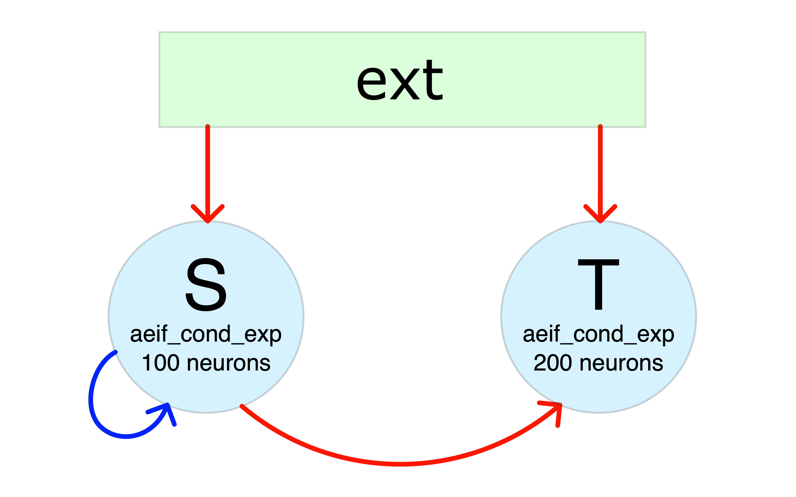

.. _example:

Example
=======

In this page I show a usage example of the implemented code.

Network configuration
^^^^^^^^^^^^^^^^^^^^^
Suppose you want to simulate the network showed in the Figure below (red (blue) arrows means excitatory (inhibitory) projections):

Then, the configuration files that you need will be similar to:

- ``subnets_config_yaml``: specify network composition and features of the neurons in each SubNetwork:

    .. literalinclude:: examples/config.yaml
        :language: yaml

- ``weights_config_yaml``: connection weights (in nS) with the convention that

        * positive weights are excitatory
        * negative weights are inhibitory

    .. literalinclude:: examples/config_weights.yaml
        :language: yaml

- ``connections_config_yaml``: connectivity probabilities between subnetworks and corresponding delays (in ms)

    .. literalinclude:: examples/config_connections.yaml
        :language: yaml

- ``to_save_config_yaml``: list of neurons whose state you want to save at each step

    .. literalinclude:: examples/config_to_save.yaml
        :language: yaml

.. attention:: The configuration files above must be saved in a directory inside the ``build`` directory.

Simulation configuration and execution
^^^^^^^^^^^^^^^^^^^^^^^^^^^^^^^^^^^^^^
Once the Network is configured you can set the simulation control variables in a yaml file ``<sim-name>.yaml``:

    .. literalinclude:: examples/example.yaml
        :language: yaml

.. note:: - the variable ``n_step`` can be used to execute the simulation in more than one step. This is useful for memory consumption issues (in case of long simulation with many neurons increase the value of n_step for better performance)
          - the ``example`` output directory is automatically created
          - note that the network configuration files has been collected in the ``config_example`` directory

And finally run the simulation using::

    $ ./main <sim-name>.yaml

Output of the simulation
^^^^^^^^^^^^^^^^^^^^^^^^

After the simulation has finished, you will find the following files in the output directory:

- a copy of the configuration files used for the simulation
- some files containing the spiking times of the neurons separately for each SubNetwork and with format::

      <neuron-index> <list-of-spike-times>

- a directory ``neuron_states`` containing:

    * a file ``t.txt`` containing the time steps of the simulation
    * a file ``<SubNetwork-name>_<neuron-index>.txt`` for each neuron indicated in ``to_save_config_yaml`` containing the state ``x`` of the neuron at each time step

    .. note:: if no neuron is indicated in ``to_save_config_yaml``, the ``neuron_states`` directory will not be produced

Basic analysis of the results
^^^^^^^^^^^^^^^^^^^^^^^^^^^^^

Using the code below:

.. literalinclude:: examples/analysis.py
    :language: python

you can easily:

- visualize the results of the simulation
    .. image:: images/hist.png
      :width: 500
- perform straightforward spectral analysis on the activity of the nuclei (S in this case)
    .. image:: images/spect.png
      :width: 500
